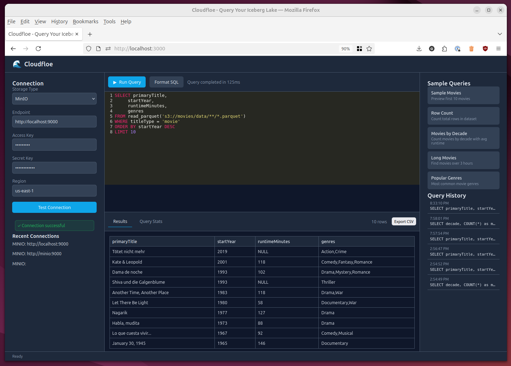

# 🌊 Cloudfloe

**Query your Iceberg data lake in seconds. No clusters. No ops. Just SQL.**



## ⚡ The Problem

You have data in Apache Iceberg. You just want to **query it**.

But here's what you face:

- **Trino/Presto**: Heavy clusters, complex setup, operational overhead
- **AWS Athena**: Vendor lock-in, slower iteration, costs add up
- **Local DuckDB**: Works great solo, painful to share and collaborate
- **Spark**: Overkill for exploratory queries, slow startup

**You don't need a hammer when you need a magnifying glass.**

---

## 💡 The Solution: Cloudfloe

Cloudfloe is **DuckDB-as-a-service** for Iceberg data lakes.

### What it does:
- 🚀 **Instant queries** on S3, R2, or MinIO — no data movement
- 🌐 **Browser-based SQL editor** — no CLI, no local setup
- 💸 **Cost transparency** — see bytes scanned before you run
- 🔓 **Zero lock-in** — you own the data, we just query it
- ⚡ **Sub-second startup** — no cluster spin-up time

### What it doesn't do:
- ❌ Store your data (you keep it where it is)
- ❌ Require infrastructure changes (just S3 credentials)
- ❌ Cost you for idle time (stateless, pay-per-query model)

**Think of it as**: A collaborative, web-based scratchpad for your data lake.

---

## ✨ Current Features

| Feature | Description |
|---------|-------------|
| 🔌 **Multi-Cloud Support** | AWS S3, Cloudflare R2, MinIO — any S3-compatible storage |
| 🖥️ **Web SQL Editor** | Syntax highlighting, auto-complete, query history |
| 📊 **Instant Results** | DuckDB engine, no cluster warmup, sub-second queries |
| 🔒 **Read-Only by Design** | No destructive operations — query, don't mutate |
| 🐳 **Docker Ready** | One command to run locally, no complex setup |

---

## 👥 Who Uses Cloudfloe?

### Data Engineers
*"I need to validate Iceberg table writes without spinning up Trino."*
- Quick sanity checks on newly written partitions
- Debug schema evolution issues
- Test query patterns before productionizing

### Analytics Engineers
*"I'm building dbt models and need fast feedback on transformations."*
- Iterate on SQL logic without waiting for Spark
- Preview results before committing to warehouse
- Share query snippets with teammates

### FinOps / Platform Engineers
*"I want to understand what our data scans actually cost."*
- Estimate query costs before running them
- Audit expensive queries across teams
- Right-size compute resources based on actual usage

### Data Scientists
*"I just want to explore the data without infrastructure headaches."*
- Ad-hoc analysis on raw data lakes
- Quick validation of data quality
- Export samples for local model training

> **If you've ever said** *"I just want to see my Iceberg data **now**"* → Cloudfloe is for you.

---

## 🚀 Quick Start

### 1. Start Cloudfloe
```bash
git clone https://github.com/gordonmurray/cloudfloe
cd cloudfloe
docker compose up -d
```

Wait ~30 seconds for initialization, then open **http://localhost:3000**

### 2. Connect to Demo Data

The demo includes **37,537 IMDb movies** automatically loaded into MinIO.

Click **"Try with Sample Data"** or manually enter:
- **Storage Type**: MinIO
- **Endpoint**: `http://localhost:9000`
- **Access Key**: `cloudfloe`
- **Secret Key**: `cloudfloe123`

### 3. Run Your First Query
```sql
-- Sample query: Movies by decade
SELECT
    decade,
    COUNT(*) as movie_count,
    AVG(runtimeMinutes) as avg_runtime
FROM read_parquet('s3://movies/data/**/*.parquet')
WHERE titleType = 'movie'
  AND runtimeMinutes IS NOT NULL
GROUP BY decade
ORDER BY decade DESC;
```

Try more queries:
```sql
-- Long movies (3+ hours)
SELECT primaryTitle, startYear, runtimeMinutes
FROM read_parquet('s3://movies/data/**/*.parquet')
WHERE runtimeMinutes > 180
ORDER BY runtimeMinutes DESC;

-- Popular genres
SELECT TRIM(genre) as genre, COUNT(*) as count
FROM (
    SELECT UNNEST(string_split(genres, ',')) as genre
    FROM read_parquet('s3://movies/data/**/*.parquet')
    WHERE titleType = 'movie' AND genres IS NOT NULL
)
GROUP BY genre
ORDER BY count DESC
LIMIT 10;
```

**That's it!** You're querying partitioned Parquet data with DuckDB.

---

## 🔗 Use Your Own Data

Cloudfloe works with any S3-compatible storage. In the UI, enter your credentials:

**AWS S3:**
```
Storage Type: S3
Endpoint: s3://your-bucket/path/to/table
Access Key: <your-access-key>
Secret Key: <your-secret-key>
Region: us-east-1
```

**Cloudflare R2:**
```
Storage Type: R2
Endpoint: https://<account-id>.r2.cloudflarestorage.com
Access Key: <your-r2-key>
Secret Key: <your-r2-secret>
```

**Any MinIO:**
```
Storage Type: MinIO
Endpoint: http://your-minio:9000
Access Key: <your-key>
Secret Key: <your-secret>
```

Then query your Parquet/Iceberg tables:
```sql
SELECT * FROM read_parquet('s3://bucket/path/**/*.parquet') LIMIT 100;
```
