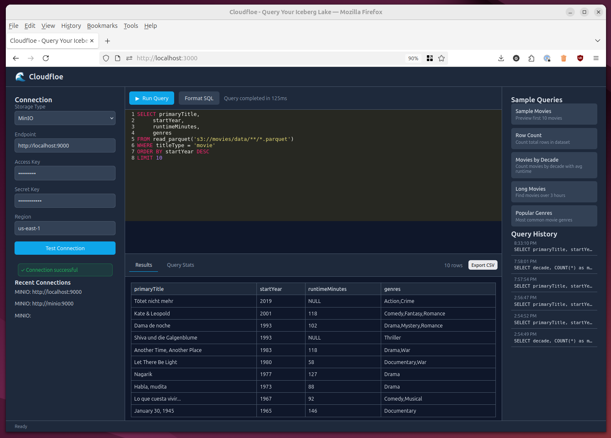

# Cloudfloe

[](https://github.com/gordonmurray/cloudfloe/actions/workflows/ci.yml)

**Query your Apache Iceberg data lake in seconds. No clusters. No ops. Just SQL.**



## The Problem

You have data in Apache Iceberg. You just want to query it.

But here's what you face:

- **Trino/Presto** — Heavy clusters, complex setup, operational overhead
- **AWS Athena** — Vendor lock-in, slower iteration, costs add up
- **Local DuckDB** — Works great solo, painful to share and collaborate
- **Spark** — Overkill for exploratory queries, slow startup
- **Direct Parquet reads** — Fast but dangerous: bypasses Iceberg metadata, can return deleted rows

You don't need a hammer when you need a magnifying glass.

---

## What Cloudfloe Does

Cloudfloe is a lightweight, browser-based SQL interface for Apache Iceberg data lakes, powered by DuckDB.

- **Reads Iceberg correctly** — uses the metadata layer, validates snapshots
- **Instant queries** on S3, R2, or MinIO — no data movement
- **Browser-based SQL editor** — no CLI, no local setup
- **Zero lock-in** — your data stays where it is
- **Sub-second startup** — no cluster spin-up time
- **Read-only by design** — query, don't mutate

Think of it as a web-based scratchpad for your Iceberg data lake.

---

## Features

| Feature | Description |
|---------|-------------|
| **Iceberg Native** | Reads via `iceberg_scan()` — respects metadata and snapshots |
| **Table Validation** | Auto-detects row-level deletes and rejects unsafe tables |
| **Multi-Cloud** | AWS S3, Cloudflare R2, MinIO — any S3-compatible storage |
| **Web SQL Editor** | Syntax highlighting, query history, sample queries |
| **Query Stats** | Execution time, bytes scanned, rows returned |
| **Docker Ready** | One command to run locally |

---

## Quick Start

### Prerequisites
- Docker and Docker Compose
- S3-compatible storage with an Iceberg table (or use the included demo data)

### 1. Start Cloudfloe
```bash
git clone https://github.com/gordonmurray/cloudfloe
cd cloudfloe
docker compose up --build
```

Wait about 30 seconds for initialization, then open **http://localhost:3000**

On first start, the bundled demo seeds a 37,537-row Iceberg table at `s3://movies/warehouse/demo/movies` in the local MinIO so you can query it immediately.

### 2. Connect to Your Iceberg Table

In the Connection panel, enter your details:

```
Storage Type:  AWS S3
Endpoint:      s3.amazonaws.com (or leave blank for default)
Table Path:    s3://your-bucket/warehouse/db/table_name
Access Key:    your-access-key
Secret Key:    your-secret-key
Region:        us-east-1
```

**Notes:**
- Table Path should point to the Iceberg table root (where the `/metadata` folder is located)
- Do not include `/metadata` in the path — Cloudfloe adds it automatically
- Trailing slashes are automatically removed

Click **Test Connection** — if successful, a sample query will appear in the editor.

### 3. Run Your First Query

After connection succeeds, a query like this will be auto-loaded:

```sql
SELECT * FROM iceberg_scan('s3://your-bucket/warehouse/db/table_name') LIMIT 10;
```

Click **Run Query** to see your data.

---

## Query Examples

### Basic Query
```sql
SELECT * FROM iceberg_scan('s3://bucket/warehouse/db/table_name') LIMIT 100;
```

### Filtering
```sql
SELECT user_id, event_type, timestamp
FROM iceberg_scan('s3://bucket/warehouse/events/user_events')
WHERE event_type = 'purchase'
  AND timestamp > '2024-01-01'
ORDER BY timestamp DESC;
```

### Aggregations
```sql
SELECT
    date_trunc('day', timestamp) as day,
    COUNT(*) as event_count,
    COUNT(DISTINCT user_id) as unique_users
FROM iceberg_scan('s3://bucket/warehouse/events/user_events')
GROUP BY day
ORDER BY day DESC;
```

### Inspect Iceberg Metadata
```sql
-- View table snapshots
SELECT * FROM iceberg_snapshots('s3://bucket/warehouse/db/table_name');

-- View manifests and partitions
SELECT * FROM iceberg_metadata('s3://bucket/warehouse/db/table_name');
```

---

## S3 Access Setup

### IAM Policy

Your AWS credentials need these permissions:

```json
{
  "Version": "2012-10-17",
  "Statement": [
    {
      "Effect": "Allow",
      "Action": [
        "s3:GetObject",
        "s3:ListBucket"
      ],
      "Resource": [
        "arn:aws:s3:::your-bucket-name",
        "arn:aws:s3:::your-bucket-name/*"
      ]
    }
  ]
}
```

### Verify Access

Before using Cloudfloe, confirm your credentials work:

```bash
aws s3 ls s3://your-bucket/warehouse/db/table_name/metadata/
aws s3 cp s3://your-bucket/warehouse/db/table_name/metadata/version-hint.text -
```

If these work, Cloudfloe will too.

---

## Limitations

**Supported:**
- Iceberg v1 and v2 table formats
- Append-only tables (no deletes)
- Parquet data files
- Time travel queries via snapshots
- Partition pruning

**Not yet supported:**
- Row-level deletes (position or equality deletes) — tables with deletes will be rejected
- Write operations — read-only for now
- REST Catalog — direct S3 path access only
- Complex schema evolution

If your table has deletes, compact it first using Spark, Trino, or the Iceberg CLI before querying with Cloudfloe.

---

## Architecture

```
+-----------------+
|   Frontend      |  Nginx + HTML/CSS/JS
|  (Port 3000)    |  CodeMirror SQL Editor
+--------+--------+
         |
         v  HTTP
+--------+--------+
|   Backend       |  FastAPI + Python
|  (Port 8000)    |  DuckDB 1.4.1 + Iceberg Extension
+--------+--------+
         |
         v  S3 API
+--------+--------+
|   S3 Storage    |  AWS S3 / R2 / MinIO
|                 |  Iceberg table (metadata + data)
+-----------------+
```

---

## Local Development

### Docker Compose (recommended)
```bash
docker compose up --build
```

### Backend manually
```bash
cd backend
python3 -m venv venv
source venv/bin/activate
pip install -r requirements.txt
uvicorn main:app --reload
```

Backend runs on http://localhost:8000

### Frontend manually
```bash
cd frontend
python3 -m http.server 3000
```

Frontend runs on http://localhost:3000
